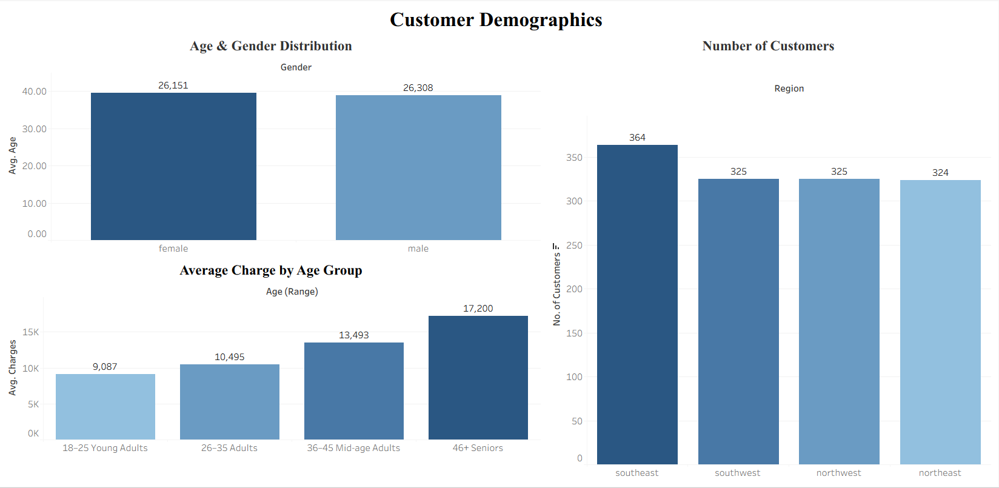
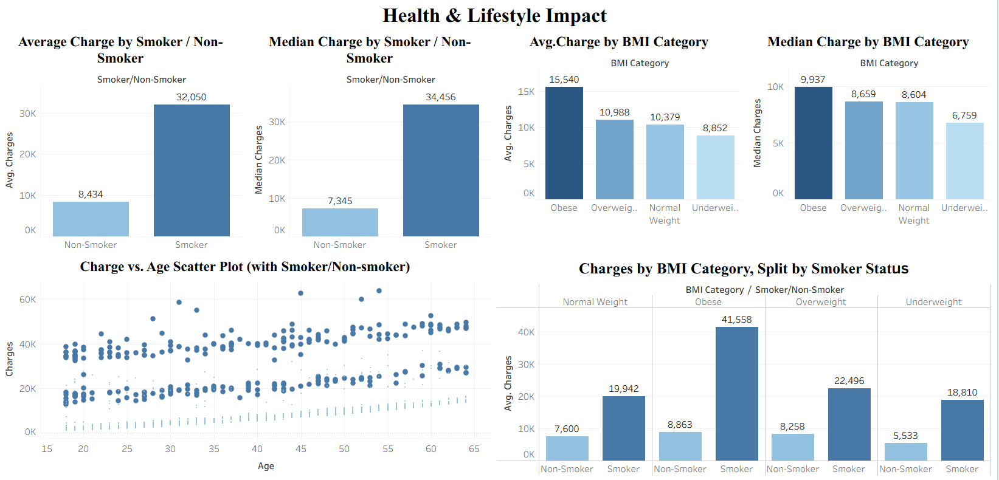
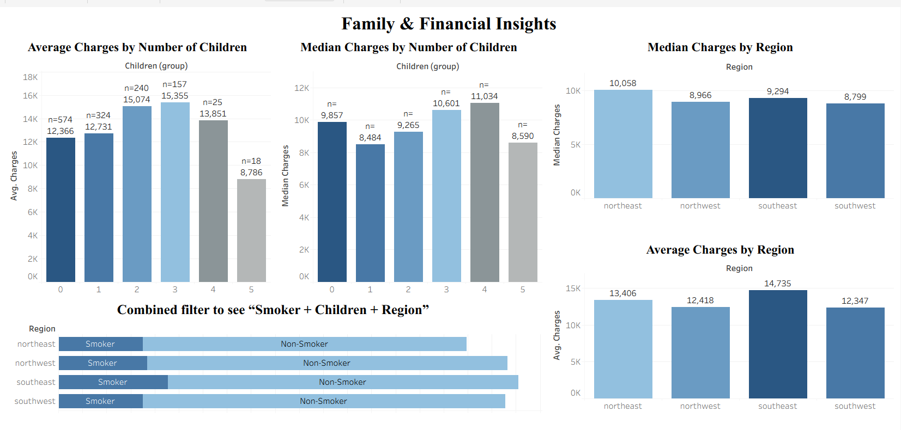

# Insurance Premium Data Analysis

Analysis of a Kaggle health insurance dataset (1,338 policyholders) to identify what drives insurance premium charges, using SQL for statistical analysis and Tableau for interactive dashboards.

## Dataset
Each row is one policyholder: Age, Gender, BMI, Children, Smoker status, Region, and Charges.

## Key Findings
- **Smoking is the dominant cost driver**: smokers pay roughly 3–4x more than non-smokers.
- **Smoking and BMI interact**: obese smokers average $41,558 vs $19,942 for normal-weight smokers — the same BMI gap barely moves cost for non-smokers ($8,863 vs $7,600).
- **Charges are right-skewed**: mean is $13,270 but median is $9,382 — mean-based comparisons alone are misleading here.
- **Age correlates positively** with charges.
- **Region**: Southeast has the highest *mean* charges, but Northeast has the highest *median* ($10,058) — Southeast's mean is inflated by a cluster of high-cost cases, not a uniformly higher typical cost.
- **Children**: charges rise up to 2–3 dependents; the drop at 5 children is a sample-size artifact (n=18), not a real trend.
- **Outlier check**: IQR analysis (done separately for smokers/non-smokers) found 46 potential outliers among non-smokers, none among smokers — confirming smoker costs are a genuinely different distribution, not data errors.
- **Gender**: minimal effect on charges.

## Tools & Method
SQL for aggregations, median (window functions), and IQR-based outlier detection. Tableau for dashboards and the smoker×BMI interaction visualization.

## Dashboards

Interactive versions on Tableau Public:
- [Dashboard 1](https://public.tableau.com/app/profile/saiba.sifat/viz/InsuranceCharges1_17881567884900/Dashboard1)
- [Dashboard 2](https://public.tableau.com/app/profile/saiba.sifat/viz/InsuranceCharges2/Dashboard2)
- [Dashboard 3](https://public.tableau.com/app/profile/saiba.sifat/viz/InsuranceCharges3/Dashboard3)

## Files
- `insurance_premium_queries.sql` — SQL analysis
- `Insurance_premium_Dataset_Report.docx` — full write-up with methodology and limitations

## Limitations
No claim history, no medical condition detail, no time-series data — premiums are treated as static.
